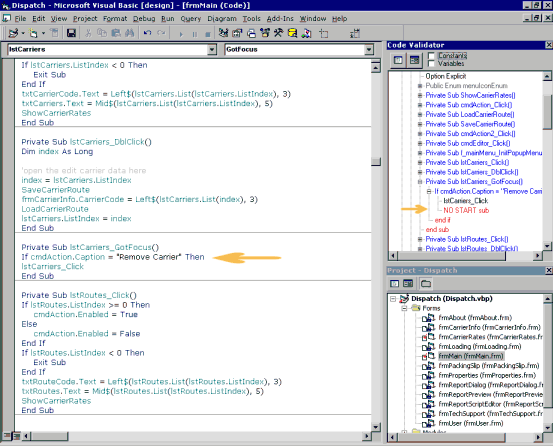



## C Style Project Explorer Add\-in

### Description

Acts as a C style project explorer for the active VB project.

Shows Enums, Declares, Property, Function, Sub

Highlights incorrect nesting in red.

Allows you to expand/contract nodes to view the code flow.

Clicking on a node will open that module and goto the selected line
 
### More Info
 
Open VB Project

Do not try to run this add in in the project that it is created from, it throws a type mismatch error, and unregisters the add-in.

Due to problems with the previous version, I've redone the code to eliminate bugs, streamline the flow, and improve understanding. Unfortunately, I've also found that some of the pop-up menu functions can't be made to work easily as the VBE.SelectedVBComponent property is read-only, and can only be updated by the Project Explorer. If any one knows a good way around this, please let me know.

Due to several requests, the DLL is now included.

As someone pointed out, I didn't mention that Steve McMahon from vbAccelerator wrote the code for the popup menu

None - Uses Tree Control

             |
---                |---
**Submitted On**   |2001-05-24 09:20:40
**By**             |[Roger Willcocks](https://github.com/Planet-Source-Code/PSCIndex/blob/master/ByAuthor/roger-willcocks.md)
**Level**          |Intermediate
**User Rating**    |5.0 (278 globes from 56 users)
**Compatibility**  |VB 6\.0
**Category**       |[Debugging and Error Handling](https://github.com/Planet-Source-Code/PSCIndex/blob/master/ByCategory/debugging-and-error-handling__1-26.md)
**World**          |[Visual Basic](https://github.com/Planet-Source-Code/PSCIndex/blob/master/ByWorld/visual-basic.md)
**Archive File**   |[C Style Pr199635232001\.zip](https://github.com/Planet-Source-Code/roger-willcocks-c-style-project-explorer-add-in__1-12490/archive/master.zip)

